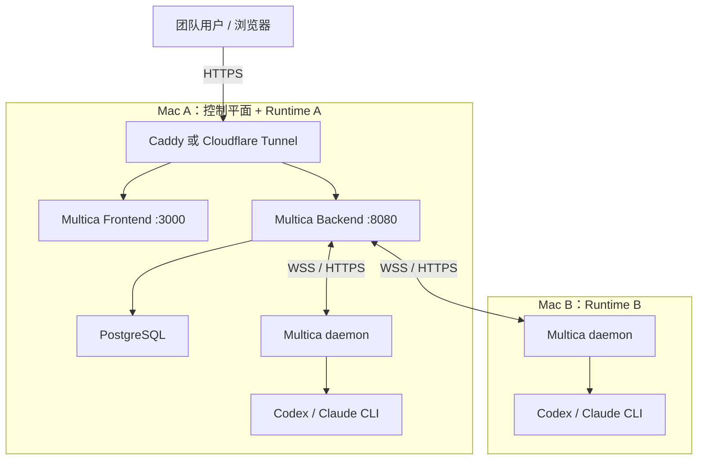

# Multica 双 Mac 部署方案

本仓库用于记录 [Multica](https://github.com/multica-ai/multica) 在两台 Mac 上的自托管部署方案，目标是：

- 通过公网域名向团队成员提供 Multica Web 服务；
- 两台 Mac 均可作为 Agent Runtime 执行节点；
- 控制平面、运行节点和公网入口职责清晰；
- 默认不向公网暴露数据库、Docker 或内部服务端口；
- 保留后续增加更多 Runtime 节点的能力。

> 当前方案是“小型团队可用部署”，不是数据库或控制平面的高可用集群。Mac A 宕机后，Web、API 和任务调度会暂停。

## 1. 推荐架构



### Mac A：控制平面

- Docker Desktop 与 Docker Compose；
- Multica Frontend、Backend、PostgreSQL；
- Caddy 或公网隧道；
- 可选运行 Multica daemon，使 Mac A 同时成为执行节点；
- 保存数据库卷和备份。

### Mac B：运行节点

- Multica CLI 与 daemon；
- Codex、Claude Code 或其他受支持的 Agent CLI；
- 任务需要访问的 Git 仓库；
- 不运行数据库和公网入口。

## 2. 域名规划

推荐准备两个域名：

| 域名 | 用途 | 内部目标 |
| --- | --- | --- |
| `app.example.com` | 用户访问 Web UI | Frontend `127.0.0.1:3000`，其中 `/ws` 转发 Backend |
| `api.example.com` | daemon、CLI 和健康检查 | Backend `127.0.0.1:8080` |

不要直接向公网开放 `3000`、`8080`、PostgreSQL 或 Docker Socket。

## 3. 实施顺序

1. 在 Mac A 安装 Docker Desktop，并启动 Multica 自托管服务。
2. 为 Mac A 配置固定局域网地址或 DHCP 地址保留。
3. 配置域名、TLS 和反向代理；无公网 IP 时使用公网隧道。
4. 创建管理员，关闭不受控的公开注册。
5. 在 Mac A 安装 daemon，将其注册为 Runtime A。
6. 在 Mac B 安装 daemon，将其注册为 Runtime B。
7. 为每台节点安装并登录 Agent CLI。
8. 邀请团队用户并进行端到端任务测试。
9. 配置数据库备份、监控和断电恢复。

## 4. 快速开始

### Mac A：启动控制平面

```bash
git clone --depth 1 https://github.com/multica-ai/multica.git
cd multica
make selfhost

docker compose -f docker-compose.selfhost.yml ps
curl -fsS http://localhost:8080/readyz
```

按照 [`deploy/env.production.example`](deploy/env.production.example) 修改 Multica 项目的 `.env`，然后重新创建容器：

```bash
docker compose -f docker-compose.selfhost.yml up -d
```

如果使用 Caddy，将 [`deploy/Caddyfile.example`](deploy/Caddyfile.example) 中的域名替换为真实域名。

### Mac A 与 Mac B：安装 Runtime

分别执行：

```bash
curl -fsSL https://raw.githubusercontent.com/multica-ai/multica/main/scripts/install.sh | bash

multica setup self-host \
  --server-url https://api.example.com \
  --app-url https://app.example.com

multica daemon status
```

然后分别安装并登录需要使用的 Agent CLI：

```bash
codex --version
claude --version
```

至少有一个可用 Agent CLI 即可，不要求同时安装全部工具。

## 5. 文档索引

- [`docs/architecture.md`](docs/architecture.md)：架构选择、网络流向和故障边界；
- [`docs/deployment.md`](docs/deployment.md)：完整部署和验收步骤；
- [`docs/mac-hardware-readiness.md`](docs/mac-hardware-readiness.md)：当前 Mac 的硬件检查、容量判断和部署前准备；
- [`docs/responsibilities.md`](docs/responsibilities.md)：两台 Mac 与人员职责分工；
- [`docs/security-and-operations.md`](docs/security-and-operations.md)：安全、备份和日常运维；
- [`deploy/Caddyfile.example`](deploy/Caddyfile.example)：反向代理模板；
- [`deploy/env.production.example`](deploy/env.production.example)：生产环境变量模板。

## 6. 上线验收

- `https://api.example.com/readyz` 返回数据库和迁移状态正常；
- `https://app.example.com` 可正常登录；
- WebSocket 连接成功，聊天内容可以流式返回；
- Settings → Runtimes 中能看到 Mac A 和 Mac B 在线；
- 两台节点分别成功执行一次测试任务；
- 普通用户无法访问管理功能或其他不应访问的 Workspace；
- Mac 重启后 Docker、反向代理和 daemon 能恢复；
- 已完成一次数据库备份与恢复演练。

## 7. 许可证提示

Multica 源码许可证允许单一组织内部使用。若要向第三方提供托管服务、SaaS、收费服务或嵌入商业产品，需要先向 Multica 项目方确认商业授权。使用官方前端时也应保留其品牌与版权信息。

## 8. 安全提示

Multica daemon 会以启动它的 macOS 用户权限执行 Agent。建议为节点创建专用的标准用户，不要让 Agent 访问个人 SSH 私钥、浏览器数据、照片或其他私人目录。

任何访问令牌、GitHub PAT、Agent API Key、数据库密码和认证密钥都不得提交到本仓库。
