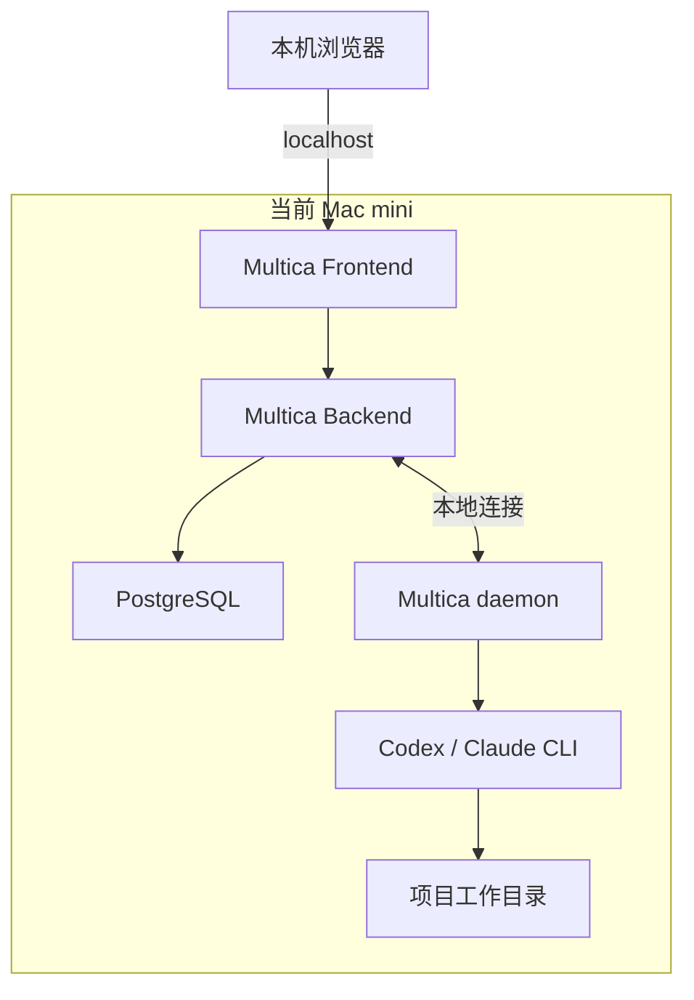

# Multica 单 Mac MVP 部署

本仓库用于在当前 Mac mini 上按照 [Multica 官方仓库](https://github.com/multica-ai/multica) 的原版方式完成最小可用部署。

现阶段只解决一个目标：

> 在一台 Mac 上启动 Multica，创建一个可用 Agent，并成功执行一次完整任务。

## 当前 MVP 范围

本阶段包含：

- 一台 Mac；
- Multica Frontend；
- Multica Backend；
- PostgreSQL；
- Multica daemon；
- 一个 Agent CLI，例如 Codex 或 Claude Code；
- 一个 Runtime；
- 一个测试 Agent；
- 一次端到端测试任务；
- 首先通过本机地址访问。

本阶段暂不包含：

- 第二台 Mac；
- 双节点任务均衡；
- 自动任务分发器；
- 正式公网开放；
- 域名和公网 HTTPS；
- 大量陌生用户注册；
- 高可用数据库和自动故障转移。

先跑通单机 MVP，再决定是否增加公网入口和第二台 Runtime。

## 单机架构



这台 Mac 同时负责：

1. 提供 Multica 网页；
2. 保存账号、任务和执行记录；
3. 接收并调度任务；
4. 运行 Agent CLI；
5. 修改代码并执行测试；
6. 将结果返回到 Multica 页面。

## 当前 Mac 配置

检查日期：2026 年 9 月 16 日。

| 项目 | 当前配置 | 判断 |
| --- | --- | --- |
| 机型 | Mac mini | 适合固定部署 |
| 芯片 | Apple M4，10 核 CPU | 性能满足 MVP |
| 内存 | 16 GB | 建议先限制为 1 个并发任务 |
| 磁盘 | 约 228 GB，总可用约 151 GB | 可以开始部署，需要监控空间 |
| 系统 | macOS 15.6 | 满足基础要求 |
| Docker | 尚未安装 | 当前首要阻塞项 |
| 自动睡眠 | 已开启 | 正式持续运行前需要关闭 |
| 断电自动启动 | 未开启 | 后续持续运行时建议开启 |

结论：当前 Mac 支持 Multica 官方单机部署。建议 MVP 阶段只同时执行一个 Agent 任务。

文档没有记录设备序列号、Hardware UUID、Provisioning UDID 等设备隐私信息。

## 第一步：安装 Docker Desktop

Multica 官方自托管服务需要 Docker。

安装适用于 Apple Silicon 的 Docker Desktop，启动后检查：

```bash
docker --version
docker compose version
docker info
```

Docker Desktop 初始资源建议：

```text
CPU：4～6 核
内存：6～8 GB
磁盘上限：60～100 GB
```

不要将全部 16 GB 内存分配给 Docker。macOS、Multica daemon 和 Agent CLI 也需要宿主机内存。

## 第二步：安装 Multica 官方自托管服务

按照官方 README 的完整安装方式执行：

```bash
curl -fsSL https://raw.githubusercontent.com/multica-ai/multica/main/scripts/install.sh \
  | bash -s -- --with-server
```

然后运行自托管初始化：

```bash
multica setup self-host
```

完成后检查：

```bash
multica daemon status
docker ps
```

官方安装脚本默认将服务文件放在 `~/.multica/server`。如果需要查看 Compose 服务：

```bash
cd ~/.multica/server
docker compose -f docker-compose.selfhost.yml ps
```

## 第三步：打开本机页面

MVP 阶段先不配置域名和公网入口，直接在当前 Mac 的浏览器打开：

```text
http://localhost:3000
```

目标是确认：

- 页面可以打开；
- 可以完成管理员或首位用户初始化；
- Backend 和 PostgreSQL 正常；
- 页面没有持续报错。

MVP 阶段可以不配置邮件服务。输入邮箱后，从 Backend 日志中读取临时验证码：

```bash
cd ~/.multica/server
docker compose -f docker-compose.selfhost.yml logs backend
```

在日志中查找：

```text
[DEV] Verification code for ...
```

该方式只用于本机 MVP。正式开放时必须配置真实邮件服务，不能依赖后台日志验证码。

Backend 健康检查可使用：

```bash
curl -fsS http://localhost:8080/readyz
```

预期数据库和迁移检查均为正常状态。

## 第四步：安装一个 Agent CLI

MVP 只需要选择一个 Agent CLI，不需要同时安装全部工具。

例如使用 Codex：

```bash
codex --version
```

或者使用 Claude Code：

```bash
claude --version
```

确保所选 CLI 已完成登录，并能在终端中独立运行。

## 第五步：创建 Runtime 和 Agent

进入 Multica 页面后：

1. 检查当前 Mac 的 Runtime 是否在线；
2. 创建一个测试 Agent；
3. 将测试 Agent 绑定到当前 Mac 的 Runtime；
4. 选择已经安装并登录的 Agent CLI；
5. 暂时只允许一个并发任务。

建议名称：

```text
Runtime：mac-mini-local
Agent：mvp-agent
```

## 第六步：运行第一次测试

第一次任务只做只读检查，不修改项目文件：

```text
请输出当前工作目录、Git 分支和 README 标题，不要修改任何文件。
```

只读任务成功后，再测试小范围修改：

```text
创建一个 test-mvp.txt 文件，写入当前时间和“MVP OK”，然后展示 Git diff。
```

检查以下完整链路：

```text
浏览器创建任务
    ↓
Multica Backend 接收任务
    ↓
本机 daemon 领取任务
    ↓
Agent CLI 执行任务
    ↓
执行日志实时返回页面
    ↓
任务完成并保存状态
```

## MVP 验收标准

以下项目全部通过，才算单机 MVP 跑通：

- Docker Desktop 正常运行；
- Multica Frontend、Backend 和 PostgreSQL 正常；
- `http://localhost:3000` 可以访问；
- Backend 健康检查正常；
- Multica daemon 显示运行中；
- 当前 Mac 的 Runtime 显示在线；
- 至少一个 Agent CLI 可以独立运行；
- 已创建一个绑定本机 Runtime 的 Agent；
- Agent 成功完成一个只读任务；
- Agent 成功完成一个小范围文件修改任务；
- 页面能看到执行日志和最终状态；
- 重启 Multica 服务后已有数据仍然存在。

## 资源和运行建议

### 并发

MVP 阶段建议：

```text
同时执行 1 个 Agent 任务
```

稳定运行后再尝试两个并发任务。如果任务包含 Docker 构建、大型前端构建或大型测试，应继续保持单任务并发。

### 磁盘

定期检查：

```bash
df -h /
docker system df
docker image ls
docker volume ls
```

建议警戒线：

| 可用空间 | 建议操作 |
| --- | --- |
| 50 GB 以上 | 正常运行 |
| 30～50 GB | 检查 Docker、仓库和依赖缓存 |
| 30 GB 以下 | 暂停新任务并立即清理 |

不要未经确认自动执行：

```bash
docker system prune -a
```

该命令可能删除仍需要的镜像和构建缓存。

### 睡眠

在 MVP 调试阶段可以暂时保持当前设置。准备让服务持续在线时，建议执行：

```bash
sudo pmset -c sleep 0
sudo pmset -c disksleep 0
sudo pmset -c displaysleep 10
sudo pmset -a autorestart 1
```

检查结果：

```bash
pmset -g custom
```

## 安全要求

- 不要把 GitHub PAT、Agent API Key、数据库密码或 `.env` 提交到 Git；
- 不要让 Agent 访问个人 SSH 私钥、浏览器数据、照片和私人文件；
- 建议后续为 Multica daemon 创建专用 macOS 标准用户；
- MVP 阶段只在本机访问，不要直接将 `3000`、`8080` 或 PostgreSQL 暴露到公网；
- Agent 修改代码后必须检查 Git diff，再决定是否提交；
- 正式向第三方开放前，需要确认 Multica 的托管许可证要求。

## 后续阶段

单机 MVP 验收通过后，再按顺序推进：

### 阶段二：局域网访问

- 固定 Mac 局域网地址；
- 让同一网络内的设备访问；
- 验证 WebSocket 和登录状态。

### 阶段三：公网访问

- 配置稳定的 HTTPS 入口；
- 配置域名或固定公网 IP；
- 配置邮件验证码服务；
- 设置邀请制、权限和备份；
- 完成安全检查后再邀请外部用户。

### 阶段四：第二台 Mac

- 第二台 Mac 只安装 daemon 和 Agent CLI；
- 将其注册为新的 Runtime；
- 创建绑定第二台 Mac 的 Agent；
- 根据实际负载决定是否开发自动任务分配。

双 Mac 架构、职责和安全运维材料暂时保留在：

- [`docs/architecture.md`](docs/architecture.md)
- [`docs/deployment.md`](docs/deployment.md)
- [`docs/responsibilities.md`](docs/responsibilities.md)
- [`docs/security-and-operations.md`](docs/security-and-operations.md)
- [`docs/mac-hardware-readiness.md`](docs/mac-hardware-readiness.md)

当前执行优先级始终是：

```text
安装 Docker
    ↓
启动官方 Multica
    ↓
本机打开页面
    ↓
连接一个 Agent CLI
    ↓
成功完成一次任务
```
